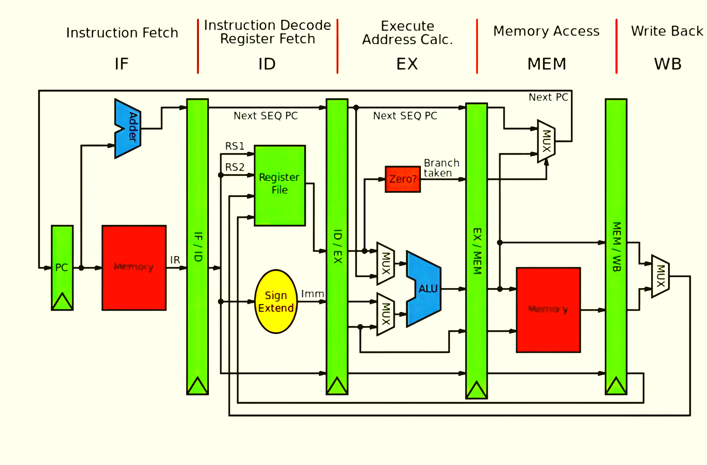

# mips-pipeline-cpu.verilog



## Introduction

This project implements a simple five-stage pipeline MIPS CPU in Verilog. It has basic hazard-handling mechanisms like forwarding and stalling. It can handle basic integer arithmetic operations such as addition, subtraction, multiplication, and division. It can also handle conditional, unconditional, and register-based branches or jumpings. It supports the use of subprocedures.

- `test_data` contains testing data of various instructions.
- `docs` contains textbooks and instruction sets of two subsets of MIPS.
- `src` contains the Verilog source code of the CPU implementation.
- `tools` contains a Mars simulator with debugging facility.


## Run

1. Open an ASM file (found from the `test_data`) in the Mars simulator and dump the code in hex format to a text file named `func.txt`.
2. Open the `src` folder in a Xilinx project. Compile the Verilog source code.
3. Ensure the file `func.txt` can be accessed by the Verilog code and run the simulation in Xilinx.
4. Optionally use the `src/utils/inspect.v` to show the time-series diagram of instruction flowing through the pipeline.

## Code Structure

```
src/
├── comp  # Major functional components.
│   ├── alu.v  # ALU.
│   ├── cmp.v  # Comparator required by beq and bne.
│   ├── ctrl.v  # Istruction controller.
│   ├── dm.v  # Data memory.
│   ├── ext.v  # Signed/Zero extensions of integers.
│   ├── fmux.v  # Multiplexers at the input of functional units.
│   ├── grf.v  # General register files.
│   ├── mips.v  # The cpu that pulls everything together.
│   ├── mux.v  # Another set of muliplexers.
│   ├── IF.v  # Instruction memory and fetching.
│   └── npc.v  # Next PC generator.
├── forward  # Forwarding modules.
│   ├── forward_btype.v  # Forward B-type instructions.
│   ├── forward_grf.v  # Forward from GRF.
│   ├── forward_ji.v  # Forward Jump-immediate (JI).
│   ├── forward_jr.v  # Forward Jump-register (JR).
│   ├── forward_rs_alu.v  # Forward RS-type from ALU.
│   ├── forward_rt_alu.v  # Forward RT-type from ALU.
│   └── forward_rt_mem.v  # Forward RT-type from DM.
├── stage  # Pipeline registers of different stages.
│   ├── EXE.v  # ID/EX reg.
│   ├── ID.v  # IF/ID reg.
│   ├── MEM.v  # EX/MEM reg.
│   └── WB.v  # MEM/WB reg.
├── stall  # Stalling modules.
│   ├── hctrl.v  # Hazard stalling controller.
│   └── hstall.v  # Stalling controllers for all stages.
└── utils  # Debugging utilities and entrypoint file.
    ├── inspect.v  # Debugging utilithy.
    └── main.v  # Simulation entrypoint.
```

## Acknowledgment

This code was inspired by the textbook *Digital Design and Computer Architecture*. Thanks to the authors for their great book.

## Citation

If you find our code useful in your research, please consider citing us as follows:
```bibtex
@misc{cong_mips-pipeline-cpuverilog_2017,
	title = {mips-pipeline-cpu.verilog: a simple five-stage pipeline {MIPS} {CPU} that handles integer operations as well as conditional and unconditional jumps.},
	shorttitle = {mips-pipeline-cpu.verilog},
	url = {https://github.com/cgsdfc/mips-pipeline-cpu.verilog},
	abstract = {This project implements a simple five-stage pipeline MIPS CPU in Verilog. It has basic hazard-handling mechanisms like forwarding and stalling. It can handle basic integer arithmetic operations such as addition, subtraction, multiplication, and division. It can also handle conditional, unconditional, and register-based branches or jumpings. It supports the use of subprocedures.},
	author = {Cong, Feng},
	year = {2017},
}
```
